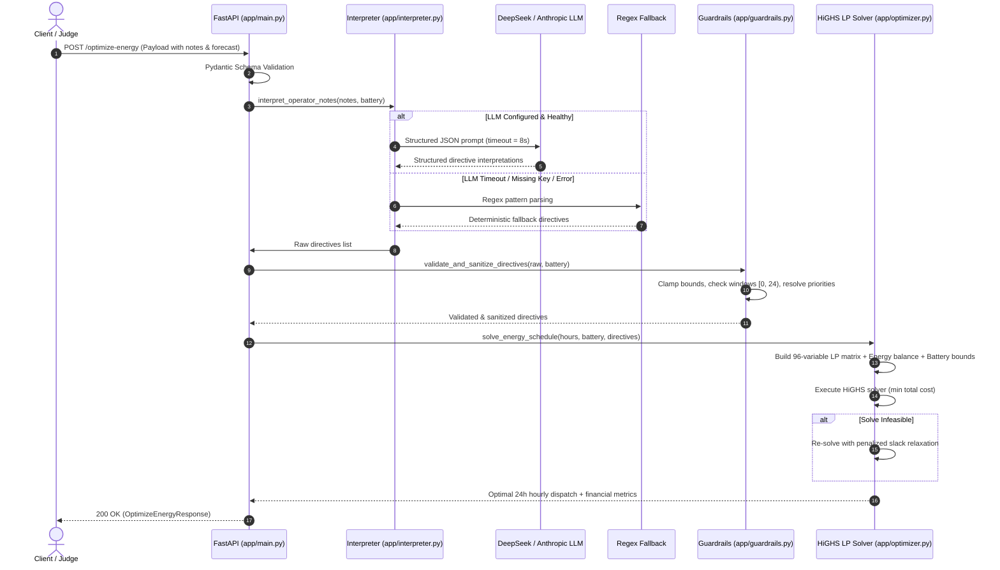

# 🏛️ GridWise System Architecture

GridWise is an end-to-end smart campus energy optimization service designed for **BUP CSE FEST 2026**. It translates unstructured natural language operator notes into mathematical constraints and schedules 24-hour battery and grid dispatch via a high-performance Linear Programming solver.

---

## 📊 High-Level Architecture Diagram

```mermaid
flowchart TD
    classDef clientStyle fill:#1e293b,stroke:#38bdf8,stroke-width:2px,color:#f8fafc;
    classDef apiStyle fill:#0f172a,stroke:#818cf8,stroke-width:2px,color:#f8fafc;
    classDef llmStyle fill:#1e1b4b,stroke:#a855f7,stroke-width:2px,color:#f8fafc;
    classDef guardStyle fill:#064e3b,stroke:#10b981,stroke-width:2px,color:#f8fafc;
    classDef solverStyle fill:#451a03,stroke:#f59e0b,stroke-width:2px,color:#f8fafc;
    classDef outStyle fill:#1e293b,stroke:#06b6d4,stroke-width:2px,color:#f8fafc;

    subgraph CLIENT_LAYER["1. Client / Ingestion Layer"]
        REQ["Operator Request (JSON)<br/>• scenario_id<br/>• battery (capacity, rates, bounds)<br/>• hours (24h solar, demand, tariff)<br/>• operator_notes (unstructured text)"]:::clientStyle
    end

    subgraph API_LAYER["2. API Gateway & Shield (app/main.py)"]
        FASTAPI["FastAPI App + CORS + Exception Shield<br/>POST /optimize-energy | GET /health"]:::apiStyle
        PYDANTIC_IN["Pydantic v2 Ingestion Validation<br/>(Rejects malformed schemas with 422)"]:::apiStyle
    end

    subgraph INTERPRETER_LAYER["3. Semantic Interpretation Engine (app/interpreter.py)"]
        direction TB
        LLM_CALL{"LLM Engine Available?<br/>(Anthropic / DeepSeek API)"}:::llmStyle
        LLM_EXEC["Strict JSON LLM Parser<br/>(8s Wall-Clock Timeout)"]:::llmStyle
        FALLBACK_REGEX["Deterministic Heuristic Parser<br/>(Regex Pattern Matcher)"]:::llmStyle
        RAW_DIRECTIVES["Raw Directives<br/>(solar_reduction, reserve, windows)"]:::llmStyle
    end

    subgraph GUARDRAIL_LAYER["4. Deterministic Guardrails (app/guardrails.py)"]
        direction TB
        VAL_HOURS["Validate Hour Ranges [0, 24)"]:::guardStyle
        VAL_BOUNDS["Clamp Parameters & Bounds<br/>(reserve ≤ capacity, 0 ≤ factor ≤ 1)"]:::guardStyle
        VAL_CONFLICTS["Deduplicate & Resolve Conflicts"]:::guardStyle
        CLEAN_DIRECTIVES["Sanitized & Applied Directives<br/>(applies: true/false + explanation)"]:::guardStyle
    end

    subgraph SOLVER_LAYER["5. Mathematical Optimizer (app/optimizer.py)"]
        direction TB
        LP_FORM["Linear Program Formulation<br/>Decision Variables: grid[24], solar_used[24],<br/>charge[24], discharge[24] (96 continuous vars)"]:::solverStyle
        
        CONSTRAINTS["Physical & Policy Constraints:<br/>1. Energy Balance: Grid + Solar + Disch = Demand + Chg<br/>2. Battery SoC Dynamics & Bounds: min_e ≤ E[t] ≤ cap<br/>3. Charge/Discharge Limits & Anti-Simultaneous Chg/Disch<br/>4. End-of-Day Neutrality: E[23] ≥ E[initial]<br/>5. Directives (Solar factor, reserve floor, grid cap)"]:::solverStyle
        
        HIGHS["SciPy HiGHS Solver (method='highs')<br/>Objective: min Σ (grid[t] * tariff[t])<br/>• Strict Solve -> Penalized Slack Fallback -> Base Heuristic"]:::solverStyle
    end

    subgraph OUTPUT_LAYER["6. Response & Delivery (app/schemas.py)"]
        RES["24-Hour Dispatch Plan (JSON)<br/>• hourly_plan (24 items with action, grid, battery)<br/>• directive_interpretation (audit trail)<br/>• total_cost_bdt, total_grid_kwh, peak_grid_kwh<br/>• plan_summary (audit logs & solver status)"]:::outStyle
    end

    REQ --> FASTAPI --> PYDANTIC_IN
    PYDANTIC_IN --> LLM_CALL
    LLM_CALL -- "API Key present & Ready" --> LLM_EXEC
    LLM_CALL -- "No Key / Timeout / Error" --> FALLBACK_REGEX
    LLM_EXEC --> RAW_DIRECTIVES
    FALLBACK_REGEX --> RAW_DIRECTIVES

    RAW_DIRECTIVES --> VAL_HOURS --> VAL_BOUNDS --> VAL_CONFLICTS --> CLEAN_DIRECTIVES
    CLEAN_DIRECTIVES --> LP_FORM
    PYDANTIC_IN -.->|"Passes battery & 24h forecast"| LP_FORM
    LP_FORM --> CONSTRAINTS --> HIGHS
    HIGHS --> RES
```

---

## 🔄 End-to-End Execution Sequence

---

## 🧩 Architectural Components & Responsibilities

| Component | Primary File | Key Responsibilities | Resiliency / Zero-Failure Guarantee |
| :--- | :--- | :--- | :--- |
| **API Shield** | `app/main.py` | Routing, CORS, Pydantic validation, exception interception | Generic 500 without leaking stack traces or internal secrets |
| **Interpreter** | `app/interpreter.py` | Extracts intent from natural language notes | Strict JSON prompt + Regex heuristic fallback (always returns parsed directives) |
| **Guardrails** | `app/guardrails.py` | Deterministic bounds validation, range clamping, deduplication | Guarantees mathematically valid inputs before the solver runs |
| **Optimizer** | `app/optimizer.py` | Linear programming formulation and global cost minimization | HiGHS LP Solver + 2-tier fallback (slack relaxation & idle battery) |
| **Data Contracts** | `app/schemas.py` | Pydantic v2 schemas for request, response, and enums | Type-safe serialisation, strict range validation |
| **Deployment** | `Dockerfile` | Multi-stage slim container packaging for production | Reproducible builds, portable across x86 and ARM |

---

## 🧮 Mathematical Formulation (HiGHS LP)

$$\min_{G, S, C, D} \sum_{t=0}^{23} G_t \cdot \text{Tariff}_t$$

**Subject to:**
1. **Energy Balance**:
   $$G_t + S_t + D_t = \text{Demand}_t + C_t \quad \forall t \in [0, 23]$$
2. **Solar Utilization**:
   $$0 \le S_t \le \text{Solar}_t \times \alpha_t \quad (\alpha_t \in [0, 1] \text{ from directives})$$
3. **Battery Energy Storage Dynamics**:
   $$E_t = E_0 + \sum_{\tau=0}^t (C_\tau - D_\tau)$$
4. **State of Charge Bounds**:
   $$\max(E_{\min}, R_t) \le E_t \le E_{\text{cap}} \quad (R_t = \text{reserve directive at hour } t)$$
5. **Rate Limits**:
   $$0 \le C_t \le R_{\text{charge}}, \quad 0 \le D_t \le R_{\text{discharge}}$$
6. **End-of-Day Neutrality**:
   $$E_{23} \ge E_0 \quad (\text{ensures battery is ready for the next day})$$
7. **Grid Caps & Window Locks**:
   $$G_t \le M_t, \quad C_t = 0 \text{ during no-charge}, \quad D_t = 0 \text{ during no-discharge}$$
